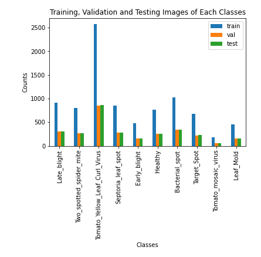

# Tomato Leaf Disease Classification

# Model Comparison

| Model | Feature Extractor     | Classifier     | Accuracy | Precision | Recall  | F1 Score |
|-------|-----------------------|----------------|----------|-----------|---------|----------|
|   1   | VGG 16                | Neural Network | 0.94749  | 0.95002   | 0.94749 | 0.94749  |
|   2   | ResNet152V2           | Neural Network | 0.96808  | 0.96923   | 0.96808 | 0.96808  |
|   3   | InceptionV3           | Neural Network | 0.95573  | 0.9566    | 0.95573 | 0.95573  |
|   4   | MovileNetV2           | Neural Network | 0.92587  | 0.93218   | 0.92587 | 0.92587  |
|   5   | Convolutional Network | Neural Network | 0.94063  | 0.9439    | 0.94063 | 0.94063  |
|   6   | VGG 16                | XGBoost        | 0.87405  | 0.87213   | 0.87405 | 0.87405  |

 

# Data Summary

**Citation**
 
Huang, Mei-Ling; Chang, Ya-Han (2020), “Dataset of Tomato Leaves”, Mendeley Data,
V1, doi: 10.17632/ngdgg79rzb.1

